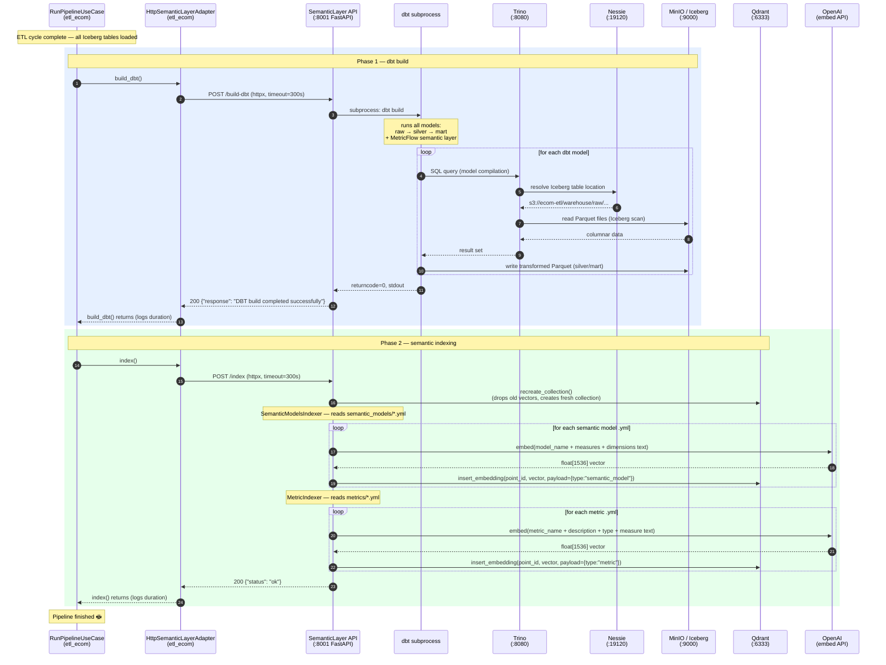

# Semantic Layer — Build Sequence Diagram

Triggered at the end of each ETL pipeline cycle, after all Iceberg tables are loaded.

## What each phase does

### Phase 1 — `POST /build-dbt`

`etl_ecom` calls `HttpSemanticLayerAdapter.build_dbt()`, which sends an HTTP POST to the semantic layer service. The service spawns `dbt build` as a subprocess. dbt compiles each model into SQL, sends it to **Trino**, which resolves table locations through **Nessie** (Iceberg catalog) and reads raw Parquet files from **MinIO**. Transformed results are written back to MinIO as new Iceberg snapshots (silver → mart layers).

### Phase 2 — `POST /index`

`etl_ecom` calls `HttpSemanticLayerAdapter.index()`. The service first **recreates the Qdrant collection** (drops stale vectors), then runs two indexers in sequence:

- **`SemanticModelsIndexer`**: reads `semantic_models/*.yml`, builds a descriptive text per model (name + measures + dimensions), sends it to the **OpenAI embedding API**, and inserts the resulting vector into Qdrant with metadata `type=semantic_model`.
- **`MetricIndexer`**: reads `metrics/*.yml`, builds a text per metric (name + description + type + measure), embeds it, inserts into Qdrant with `type=metric`.

After indexing, the Qdrant collection holds vectors for every semantic model and metric — ready to serve similarity searches when the `/ask` endpoint receives a user question.
